# NETVISTA

A visual **network digital twin** backed by a **real** emulated network. Mininet, Open vSwitch,
Linux routers and tc/netem carry real packets. The browser dashboard shows them live: you inject
latency, loss, bandwidth caps, link and router failures, and watch an adaptive routing
controller detect the fault and reroute. A SimPy twin of the same topology predicts the effect
of a change *before* you apply it, and a validation page measures how right it was.

An AI layer watches the same measurements. Each link and flow learns its own normal, so
faults too subtle for the fixed health rules are still caught. A root-cause engine names the
link or router that explains every bad and every healthy probe. A copilot (Claude, or a local
model through Ollama) answers questions from live data through tools, asks the twin "what if",
and proposes changes that only you can apply.

**Assure** closes the loop. You state *intents*: "c1 → srv1 round trip p95 ≤ 30 ms, even
after any single link or router failure", "keep every core link under 85 %", "c2 → srv2 must
avoid r3". They are checked every second on the live network. A fast fluid twin predicts, for
every possible single failure, which intents would break and whether any routing could have
avoided it (an exhaustive search is the proof). A planner computes every flow's path *and* a
pre-checked backup for every failure, the packet twin cross-checks it, an autopilot applies it
only through a safety gate, and every deployment and drill is measured to show whether the
prediction was right. A live benchmark compares it with static and adaptive routing on the
same failures.

The **Designer** lets you draw a network in the browser and boot it as real Linux routers:
the answer to "Packet Tracer already does that". Packet Tracer simulates a network; NETVISTA
deploys one, measures it, predicts it and proves the predictions.

Every number in the live views comes from the emulation (interface counters, probe agents,
iperf3 receivers). Simulated values are always labelled **Simulation**, and AI-written text is
labelled **AI answer**, with every measured value checked against the data the model read.
Nothing is mocked.

See **[DESIGN.md](DESIGN.md)** for the architecture, every design decision, the validation
results and the limitations.

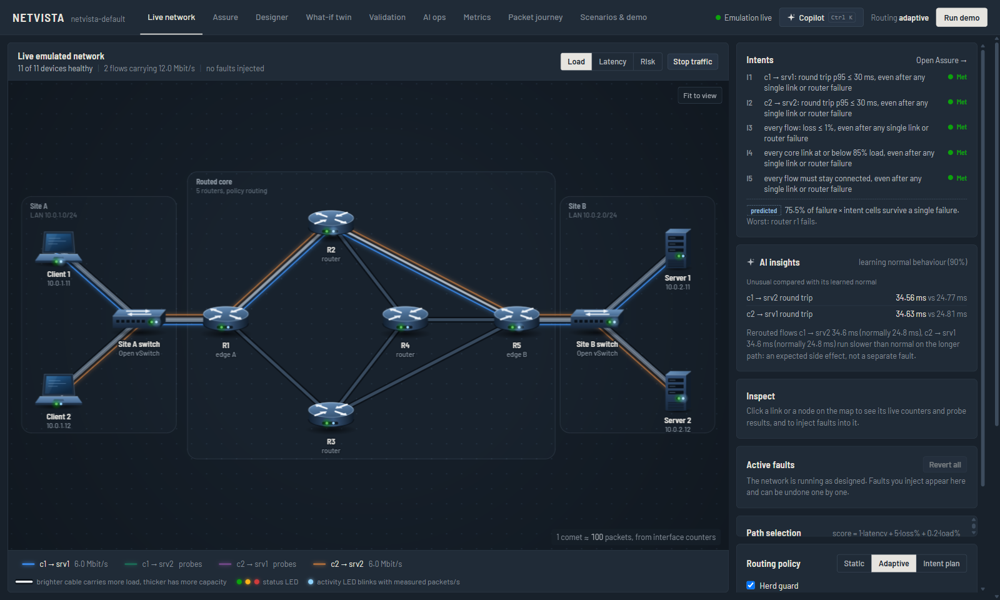

**Contents:** [Features](#features) · [Architecture](#architecture) · [How it works](#how-it-works)
· [Results](#results) · [Screenshots](#screenshots) · [1. Requirements](#1-requirements) · [2. Run it](#2-run-it-one-command)
· [3. Demo](#3-how-to-demo-each-phase) · [4. Tests](#4-tests) · [5. Layout](#5-project-layout)
· [6. Limitations](#6-known-limitations) · [7. Troubleshooting](#7-troubleshooting)

---

## Features

| Area | What you get |
|---|---|
| **Live network** | 11 devices (5 Linux routers, 2 Open vSwitch switches, 2 clients, 2 servers) in Mininet. The map shows real counters, probe RTT and loss, with packet comets driven by interface packets/s |
| **Chaos lab** | Reversible latency, loss, bandwidth caps, link-down, router crash and traffic bursts, applied with `tc`/`netem`/`ip link` |
| **Adaptive routing** | Own Dijkstra + Yen K-shortest paths, a latency/loss/load score, make-before-break policy routes, failure detection in ~1.3 s, reroute in ~15-55 ms |
| **Digital twin** | A SimPy model of the same topology, calibrated from live probes. Predict a change before applying it, then validate the prediction against the real network |
| **AI layer** | Learned-baseline anomaly detection, probe-path root-cause analysis, and a grounded LLM copilot that can only *propose* changes |
| **Assure (intents)** | 8 intent kinds (latency, loss, reach, bandwidth headroom, link load, avoid, waypoint, path diversity), each optionally required to survive any single failure; checked live every second with compliance history |
| **Failure analysis** | Every single link and router failure, predicted in ~0.2 s with a fluid twin that matches the packet twin within 0.5 % (1000× faster); each break classified as avoidable, unavoidable (exhaustive proof) or a single point of failure; fragility map |
| **Planner + autopilot** | Joint routing of all flows plus pre-checked backups per failure, an intent routing mode with wait-to-restore, a herd guard for the adaptive controller, shadow / approve / auto modes, a safety gate, verification on live measurements and automatic rollback |
| **Evidence** | Live drills (fail an element, check the prediction), a live benchmark of four routing strategies, a predicted-vs-measured ledger and prediction intervals with measured coverage |
| **Designer** | Draw a topology, get design checks (disjoint paths, SPOFs, capacity), save it, and redeploy the emulation with it in place; Abilene and a metro ring are built in |
| **Packet journey, metrics, scenarios** | Per-hop kernel routing decisions, traceroute, 15 min metrics, record/replay and a one-button demo |

## Architecture

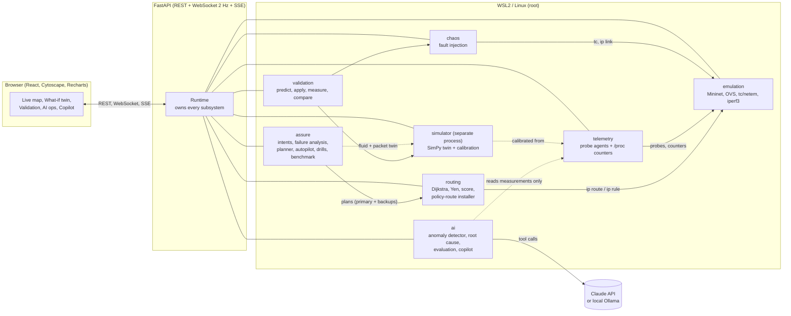

### The emulated topology

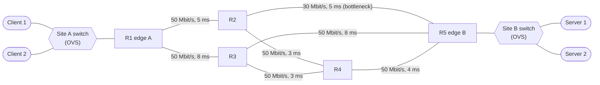

Routers are Linux network namespaces, so every routing decision is a real kernel decision you
can inspect with `ip route get` and `traceroute`.

## How it works

### Failure detection and reroute

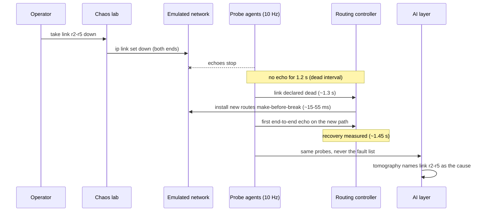

### AI pipeline

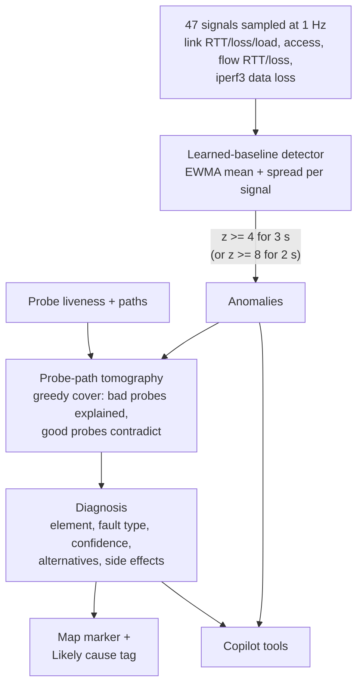

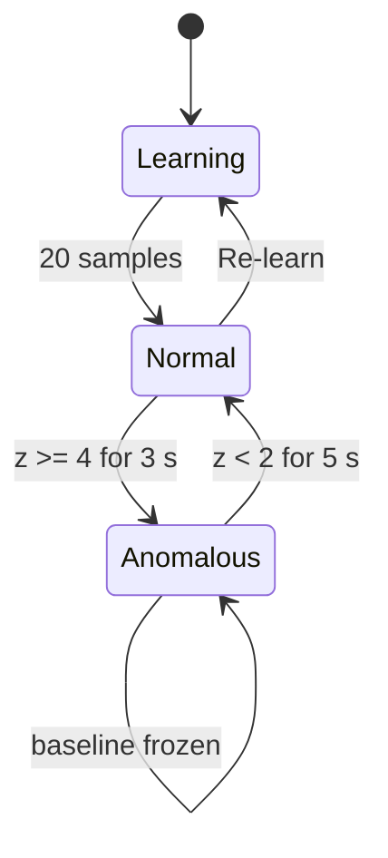

### Copilot: it proposes, you decide

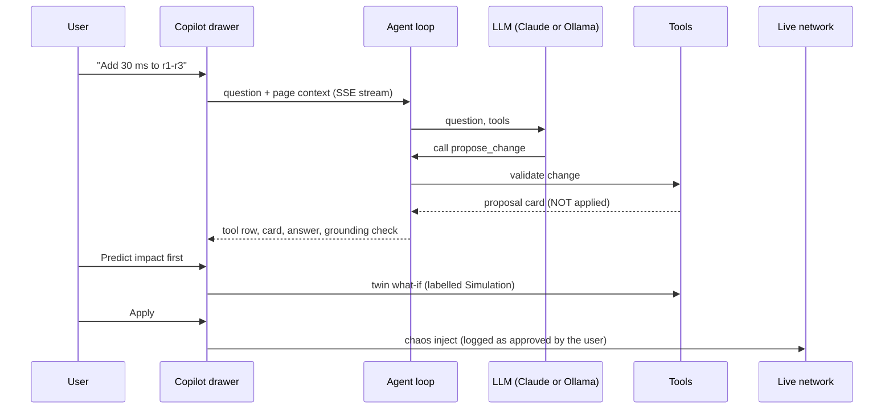

The model has read tools (live state, AI insights, events), one simulate tool (the twin) and
propose tools. It has no tool that changes the network. After each answer, every measured
value is looked up in the data the model read; values it cannot trace are underlined.

### Assure: intents to proof

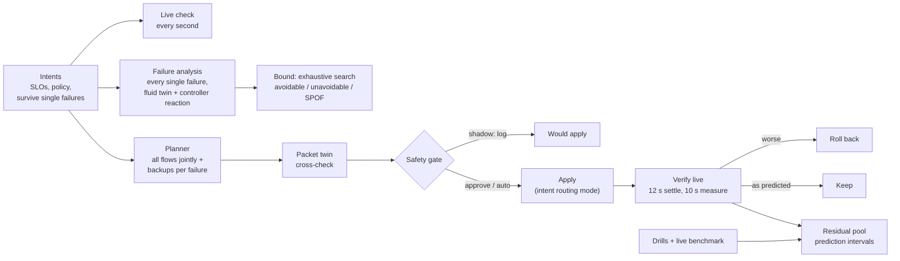

The controller follows the plan in **intent mode**: flows are pinned to their primary paths,
and when links die the controller names the failure (one link, or several links sharing one
router) and installs that failure's pre-planned backups at once. Restored links are trusted
again only after a 5 s wait-to-restore.

### Validation loop

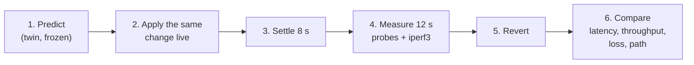

## Results

All measured on the live emulation (Windows 11, WSL2 Ubuntu 24.04). Details in DESIGN.md.

| Measurement | Result |
|---|---|
| Failure detection / reroute / recovery | 1.26-1.32 s / 12-41 ms / 1.34-1.43 s |
| Packet twin vs live, 11 scenarios: RTT p50 / p95 | 0.23 % / 0.67 % mean error |
| Fluid twin vs live, same scenarios: RTT p50 / p95 | 0.59 % / 1.08 %, at 0.2-2.2 ms per prediction |
| Bottleneck throughput (packet / fluid) | 0.16 % / 0.05 % total error; per-flow loss 1.37 / 1.34 pp; paths 100 % |
| Prediction intervals (90 % nominal), RTT | fluid ±3.8 %, measured coverage 90.1 %; packet ±3.2 %, 91.4 % |
| Live benchmark, 10 failures × 4 strategies (weighted intent-seconds violated) | static 6730, adaptive 2516-2597, **intent plan 1517**; in normal operation 920-943 vs **73** |
| Benchmark: route changes / data delivered / predictions right | adaptive 26-29 / 97.8-98.1 % / 3-7 of 10; plan **12 / 98.4 % / 8 of 10** |
| Failure analysis + plan, default / Abilene (deployed live from the Designer) | 0.2 s + 0.6 s / 1.8 s + 3.9 s; Abilene plan verified live, drill 100 % as predicted |
| False link failures in a 5 min soak (stress traffic, heavy polling) | 0 (57 before the WSL2 host-stall guard) |
| AI detector, 8 injected faults (2 runs) | 8 of 8 caught (threshold rules: 7 of 8, missed +2 ms) |
| AI root cause named correctly / false alarms in a quiet minute | 8 of 8 / 0 |
| Tests | see [4. Tests](#4-tests) |

The benchmark's honest details (where the plan lost, and why the first run is not the headline)
are in DESIGN.md §11.9; every complete run is kept in [docs/results/RESULTS.md](docs/results/RESULTS.md).

## Screenshots

All taken from the running system (dashed borders and the "predicted" tag mark predictions;
everything else is measured).

| | |
|---|---|
| 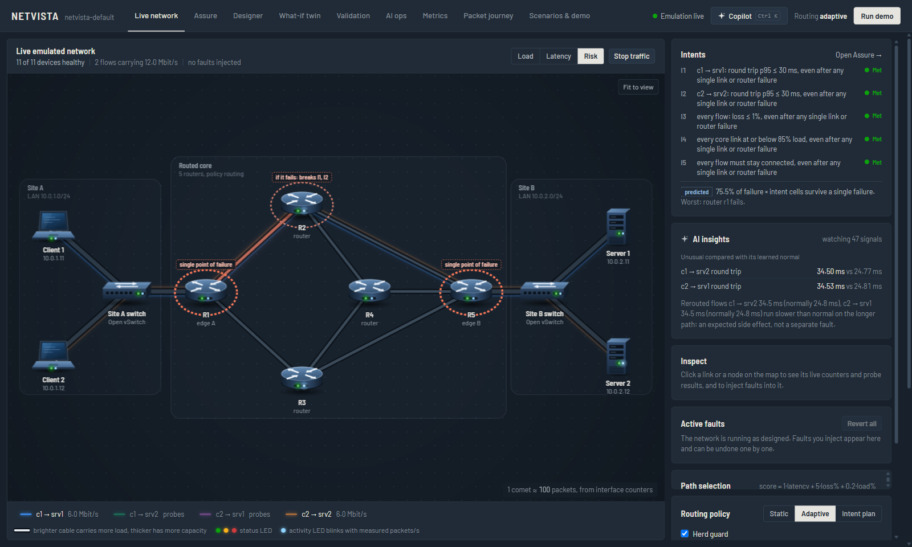 | 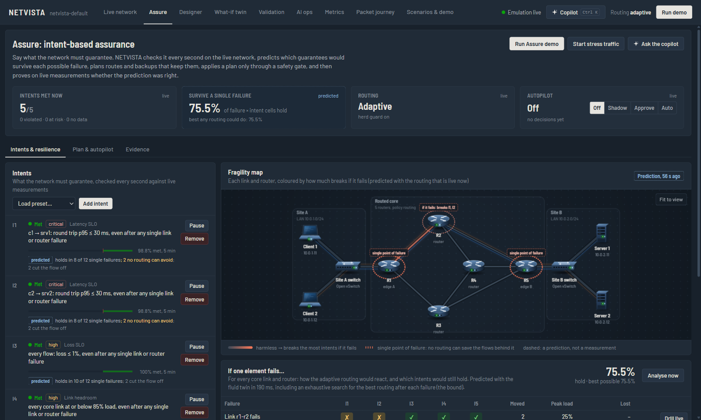 |
| **Risk view.** Each element is coloured by how many intents break if it fails; dashed halos mark single points of failure | **Assure.** Intents checked live every second, the fragility map, and the per-failure matrix with the exhaustive best-routing bound |
| 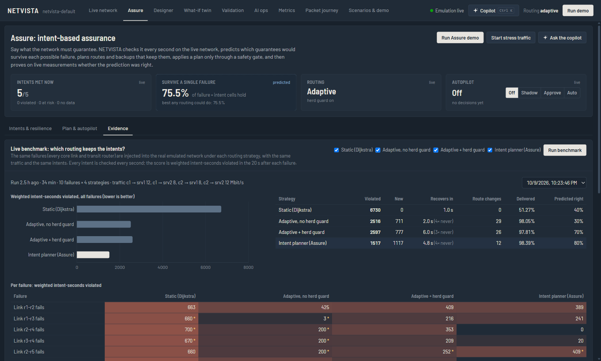 | 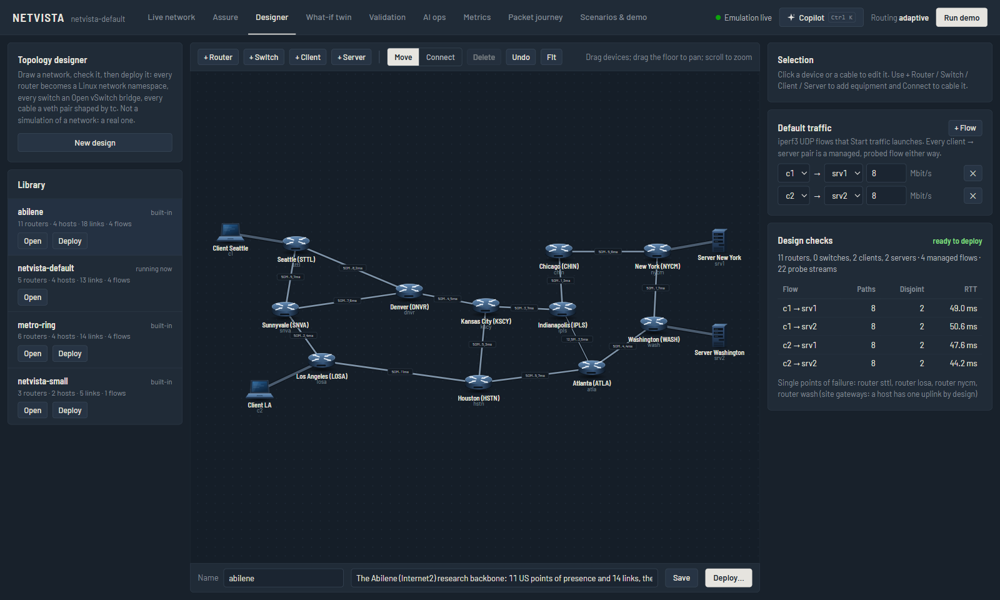 |
| **Evidence.** The live benchmark of four routing strategies over every core failure | **Designer.** Abilene opened from the library with its design checks. "Deploy" boots it as real Linux routers |
| 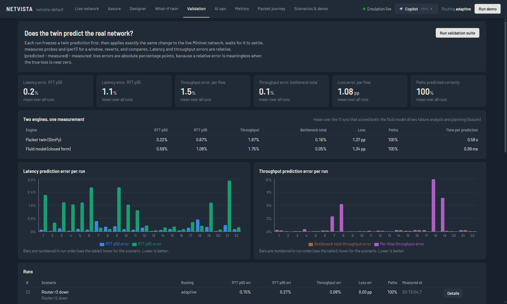 | |
| **Validation.** Both twins against the live network, 22 runs | |

---

## 1. Requirements

| | Windows 11 (how this was developed) | Linux |
|---|---|---|
| Emulation | WSL2 + Ubuntu 24.04 (`wsl --install -d Ubuntu-24.04`) | Ubuntu 22.04/24.04 |
| Root | `wsl -u root` (used by the launcher) | `sudo` |
| UI build | Node.js 18+ on Windows | Node.js 18+ |
| Inside Linux | installed automatically: mininet, openvswitch-switch, iperf3, traceroute, Python venv (fastapi, simpy, networkx, anthropic) | same |
| Copilot (optional) | a free Gemini key (Groq as backup) or an Anthropic key in `.env`, **or** Ollama for Windows with a tool-capable model | an API key, or Ollama |

The WSL2 kernel (6.x) already ships the `openvswitch`, `sch_netem` and `sch_htb` modules. No VM
is needed.

## 2. Run it (one command)

**Windows** (from the repo folder, e.g. `C:\dev\NETVISTA`):

```powershell
powershell -ExecutionPolicy Bypass -File scripts\run.ps1
```

The first run installs the Linux packages inside WSL (a few minutes) and builds the UI. It then
starts the emulation and opens <http://127.0.0.1:8000>. Press Ctrl+C to stop; Mininet is cleaned
up automatically.

Options: `-Rebuild` (rebuild the UI), `-Topology topologies\small.json`, `-Port 8080`.

**Linux:**

```bash
cd frontend && npm install && npm run build && cd ..
sudo bash scripts/run.sh            # first run calls scripts/setup_wsl.sh
```

**UI development** (hot reload, backend still in WSL): `cd frontend && npm run dev`, then open
<http://localhost:5173> (it proxies `/api` and `/ws` to :8000).

**Copilot setup** (optional; anomaly detection and root-cause analysis work without it):

* **Free: Gemini, with Groq as backup.** Copy `.env.example` to `.env` in the repo root and set
  `GEMINI_API_KEY=...` (from [AI Studio](https://aistudio.google.com/apikey)) and optionally
  `GROQ_API_KEY=...` (from [Groq](https://console.groq.com/keys)), then restart. Gemini 3.8 Flash
  answers. When it is rate-limited, down or rejects its key, Groq's GPT-OSS 120B answers instead
  (that round, then Gemini again after a 60 s rest), and the answer says so. Groq is the backup
  because its free tier allows only ~8k tokens per minute.
* **Claude:** set `ANTHROPIC_API_KEY=...` instead. The default model is `claude-opus-5-5`. Set
  `NETVISTA_AI_MODEL=claude-sonnet-5-5` or `claude-haiku-5-5` for cheaper, faster answers.
* **Local, offline:** install [Ollama](https://ollama.com), pull a model with tool support
  (e.g. `ollama pull qwen3:8b`), and restart NETVISTA. It is found automatically, even though
  the backend runs in WSL (through Windows' `curl.exe` via WSL interop). On a CPU-only laptop
  expect one to four minutes per answer.
* The **AI ops** page shows which model is in use. Its **Check again** button re-detects
  without a restart.

## 3. How to demo each phase

Start the system, then on the **Live network** page:

### Phase 1: real topology and live visualisation
1. The map shows the real equipment: 5 routers, 2 Open vSwitch site switches, 2 laptops and 2
   servers, grouped into Site A, the routed core and Site B. Each device has a status LED
   (measured health) and an activity LED that blinks with its measured packets/s. Grey specks
   on the cables are the probe traffic that is always flowing.
2. Click **Start traffic**. Two iperf3 UDP flows (6 Mbit/s each) start and draw themselves in
   as coloured fibres along their paths. Comets in the flow's colour stream along them, and
   the loaded cables brighten and glow.
3. Hover any cable or device for a quick card (load, round trip, which flows it carries).
   Click it for the full inspector: utilisation and RTT sparklines, per-direction rate,
   packets/s, drops and queue, and RTT percentiles vs design. Hover a flow chip in the legend
   to follow that flow on its own.
4. Toggle **Load / Latency** to make the cables glow with utilisation or with how much slower
   than designed they measure. **Fit to view** resets pan and zoom.

### Phase 2: chaos lab
1. With a link selected: **Add latency** (+60 ms), **Drop packets** (5 %), **Cap bandwidth**,
   **Take link down**. With a router selected: **Crash**. With a client selected: **Start burst**.
2. Each fault appears under **Active faults** with its own **Revert**, and in the **Event log**.
3. The effect is real: open the link inspector and watch the measured RTT jump by 2 × the
   added latency.

### Phase 3: adaptive routing
1. **Path selection** shows each flow's candidate paths with latency, loss, load and score,
   re-scored every second, with the chosen path highlighted.
2. Take r2-r5 down. After ~1.3 s the cable turns red with a pulsing break, R2 and R5 get amber
   rings, the fibres redraw themselves along r1-r2-r4-r5 while the old route fades, and
   **Failure handling** lists detection (≈1.3 s), reroute (≈15–25 ms) and recovery (≈1.45 s).
   Crash a router to see it go dark with a red pulse.
3. Revert, switch **Routing policy** to *Static (Dijkstra)*, and repeat. Static routing does
   not react: the flow table shows "no echo" and data loss until you revert.
4. Change the score weights (e.g. loss weight 20) and see the path choice change.

### Phase 4: digital twin and validation
1. **What-if twin** page: add changes (e.g. +40 ms on r2-r5, or Router r2 down), press
   **Predict**. The LIVE map and the dashed SIMULATION map appear side by side, with a table of
   Live now / Twin unchanged / Twin what-if for RTT p50/p95/p99, loss, throughput and path. The
   twin also predicts whether the adaptive controller will reroute.
2. **Validate live** applies the same change to the real network, measures, reverts and
   compares.
3. **Validation** page → **Run validation suite** (~7 min): 11 scenarios in static and adaptive
   mode, with latency, throughput, loss and path errors per run, charts and drill-down tables.

### Phase 5: polish
* **Packet journey**: pick a source and destination. The path is highlighted, and every hop
  shows its live kernel decision (`ip route get`), its routing table and its outgoing link's
  metrics. **Run real traceroute** runs traceroute inside the source namespace and checks it
  against the installed path.
* **Metrics**: throughput, data loss, probe loss and RTT p50/p95/p99 over 1/5/15 minutes.
* **Scenarios & demo**: **Run demo** (also in the header) does a ~45 s live sequence: start
  traffic → +80 ms on the main flow's link → reroute → crash a router on the new path →
  recover → summary with measured timings. **Record a scenario**, do things, **Stop and save**,
  then **Replay live** re-executes the same actions at the same offsets.

### Phase 6: AI layer
1. **Subtle fault the rules miss.** With traffic running, click the r2-r5 cable, set Latency
   to 2 ms in the inspector and press **Add latency**. The cable stays green: the threshold rule
   only fires above about 17 ms. Within about 3 s,
   **AI insights** says "Link r2-r5 has extra latency", the map shows a dotted AI marker on the
   cable and a **Likely cause** tag, and the event log records the anomaly.
2. **Root cause, not symptoms.** Crash router r2. Three links go dark, but the diagnosis is one
   cause, "Router r2 is down" at high confidence. It lists the flows the controller moved off it,
   and reports their higher RTT as a side effect, not a second fault.
3. **Copilot.** Press **Copilot** (or Ctrl+K), or **Explain** on a diagnosis. Each answer shows:
   * the tools it used, with the raw data one click away;
   * a dotted "AI answer" label;
   * how many of its measured values were traced to that data (any that weren't are
     underlined).

   Try "What would happen if router r2 crashed?" (it runs the twin), "Add 50 ms to r1-r2"
   (it proposes a card: **Predict impact first**, then **Apply**), or **Post-mortem** on an
   incident.
4. **AI ops page.** Every watched signal with its learned normal and alarm line, a chart of
   measured vs learned normal, and the copilot's status. **Run evaluation** (~5 min) injects 8
   real faults and compares the learned detector with the threshold rules, plus the diagnosis
   accuracy.

### Phase 7: Assure (intents, failure analysis, planning, proof)
1. Open **Assure**. Choose **Load preset… → Gold / bronze SLOs**: two gold latency SLOs derived
   from the design (30 ms here), loss ≤ 1 %, core links ≤ 85 %, reachability; all must survive any
   single failure. Each intent shows its live status, a 5-minute status strip and its share met.
2. Press **Start stress traffic** (every flow loaded, 40 Mbit/s in total). Within seconds the
   adaptive controller balances load and usually parks a gold flow on a 34-37 ms path: the gold
   intent turns **Violated**.
3. The **fragility map** colours every link and router by how much breaks if it fails (dashed:
   a prediction). The **If one element fails…** matrix shows, per failure and intent, held / at
   risk / avoidable / unavoidable / cut off, the predicted peak load and lost traffic, and the
   resilience score next to the best any routing could reach. Click a row for paths and RTT after
   that failure.
4. **Plan & autopilot → Make a plan** (~1 s): current vs planned paths, predicted RTT with its
   interval, resilience before → after (here 59 % → 75.5 %, equal to the bound), the objective,
   and the backups per failure. **Cross-check (packet twin)** compares it with the SimPy model.
   **Apply plan**: routing switches to *intent* mode, and after 12 s + 10 s the plan is verified on
   live measurements (or rolled back automatically).
5. Back on the matrix, press **Drill live** on a failure (e.g. Link r2-r5): the failure is
   injected, every intent watched each second, and the prediction scored (Evidence tab).
6. **Autopilot**: *Shadow* logs what it would do on every change; *Approve* waits for you;
   *Auto* applies plans that pass the safety gate. Try Auto, then crash r3 in the chaos lab.
7. **Evidence → Run benchmark** (~35 min): static vs adaptive (with and without the herd guard) vs
   the intent plan on every core link and transit router, scored in weighted intent-seconds
   violated, with the failure analysis' prediction checked against every outcome.

### Phase 8: Designer
1. Open **Designer**: the running topology is in the editor. Open **abilene** from the library.
2. **+ Router**, then **Connect** and click two devices to cable them; select a cable to edit its
   capacity, delay, jitter, loss and buffer. **Design checks** update on every edit: disjoint paths
   per flow, single points of failure, traffic that cannot fit. An unconnected router makes it
   "cannot boot".
3. **Save**, then **Deploy…**: the running network is torn down and the design boots as real
   Linux routers in 10-30 s; every page (Assure included) now works on it.

## 4. Tests

```bash
# unit tests (routing, scoring, both twins, parsers, validation maths, AI, Assure, topology library)
wsl -d Ubuntu-24.04 -u root -- bash -c "cd /mnt/c/Users/hardi/OneDrive/Desktop/NETVISTA/backend && /opt/netvista/venv/bin/python -m pytest -m 'not emulation'"
# smoke tests that boot real Mininet topologies (stop the app first: same interface names)
wsl -d Ubuntu-24.04 -u root -- bash -c "cd /mnt/c/Users/hardi/OneDrive/Desktop/NETVISTA/backend && /opt/netvista/venv/bin/python -m pytest -m emulation"
# end-to-end acceptance against the running app
wsl -d Ubuntu-24.04 -u root -- /opt/netvista/venv/bin/python /mnt/c/Users/hardi/OneDrive/Desktop/NETVISTA/scripts/live_check.py
# calibration + full twin validation suite against the running app
wsl -d Ubuntu-24.04 -u root -- /opt/netvista/venv/bin/python /mnt/c/Users/hardi/OneDrive/Desktop/NETVISTA/scripts/twin_check.py --suite
```

Results at the time of writing: 179 unit tests and 2 emulation smoke tests pass,
`live_check.py` (which now ends with an Assure plan, its live verification and a drill) reports
ALL CHECKS PASSED, the validation figures for both twins are in DESIGN.md §9 and the live
benchmark in §11.9.

## 5. Project layout

```
topologies/          default.json (5 routers, 2 switches, 2 clients, 2 servers), small.json,
                     abilene.json (the Internet2 research backbone), metro-ring.json; user/ = saved designs
backend/netvista/
  topology/          JSON model + validation, derived IP addressing plan, library + design checks
  emulation/         Mininet builder, tc/netem/htb, nsenter helpers, iperf3 traffic manager
  telemetry/         probe agent (runs in each namespace), /proc + tc counters, health views
  chaos/             reversible fault injection mapped to tc / ip link
  routing/           own Dijkstra + Yen, path score, policy-route installer, controller
                     (static / adaptive with herd guard / intent plans with backups + WTR)
  simulator/         SimPy packet model, fluid model (fast twin), calibration, what-if + routing prediction
  validation/        predict → apply live → measure → compare
  scenarios/         record / replay, scripted demo
  ai/                signals, learned-baseline detector, probe-path root cause, evaluation
    copilot/         LLM agent: providers (Claude / Ollama), tools, grounding check, prompt
  assure/            intents, failure analysis, planner, autopilot, drills, live benchmark,
                     prediction intervals (conformal pool)
  api/               FastAPI REST + WebSocket, serves the built UI
  runtime.py         wires everything together, composes the live snapshot
backend/tests/       pytest (unit + Mininet smoke tests)
frontend/src/        React + TypeScript + Tailwind + Cytoscape.js + Recharts
scripts/             run.ps1 (Windows), run.sh / stop.sh / setup_wsl.sh (Linux/WSL), checks,
                     export_results.py; diagnostics/ = the WSL2 packet-path stall reproduction
runs/                event log, calibration, validation + AI evaluation runs, intents, residual
                     pool, drills, benchmarks, deployment ledger, scenarios (git-ignored)
.env.example         copilot settings (copy to .env, git-ignored)
```

## 6. Known limitations

Short version (details in DESIGN.md §16):

* Failure detection is probe-based (10 Hz, 1.2 s dead interval), so it takes ~1.3 s, like BFD.
  It is not sub-second.
* L2 segments behind a switch are probed only as host → gateway.
* Under heavy tail-drop overload the twin predicts the bottleneck's total goodput and the
  queueing delay accurately, but not how the loss is split between flows (that depends on
  kernel packet micro-timing).
* Traffic is UDP CBR (iperf3). TCP dynamics are not modelled, by either twin, so Assure's
  predictions cover the traffic the emulation carries.
* Scale is tens of nodes (Python threads per probe stream, packet-level twin).
* The AI detector is bounded by the probe rate (10/s). About 1 % random loss takes many seconds
  to separate from chance, unless iperf3 traffic crosses the link.
* The diagnosis is greedy (one element per symptom set). A switch and its uplink cannot be
  told apart, so both are shown.
* A local LLM on a CPU-only laptop takes minutes per answer. Claude takes seconds, but needs an
  API key.
* Assure plans paths, not capacity: when no routing can meet an intent after a failure it says
  so ("unavoidable") but does not propose an upgrade. Double failures are analysed, not
  pre-planned. Prediction intervals are empirical, with measured (not guaranteed) coverage.
* On WSL2 the namespaced packet path freezes for ~1 s about every 33 s. This is reproduced
  without NETVISTA by `scripts/diagnostics/netns_stall.sh`. Every probe goes mute at once, so
  NETVISTA recognises these stalls and does not count them as link failures (they are logged as
  `telemetry.stall`). A real failure that starts during a stall is detected up to ~1 s later.
* eBPF/XDP telemetry was not built.

## 7. Troubleshooting

* **"The emulated network did not start"**: run the launcher (needs root in WSL). If Open
  vSwitch is the problem, start with `NETVISTA_SWITCH=linuxbridge` (needs `bridge-utils`).
* **Stale state after a crash**: `wsl -d Ubuntu-24.04 -u root -- bash /mnt/c/Users/hardi/OneDrive/Desktop/NETVISTA/scripts/stop.sh`
  (kills agents and iperf3, runs `mn -c`).
* **Backend log**: the launcher prints it to the console. Events are also appended to
  `runs/events.jsonl`.
